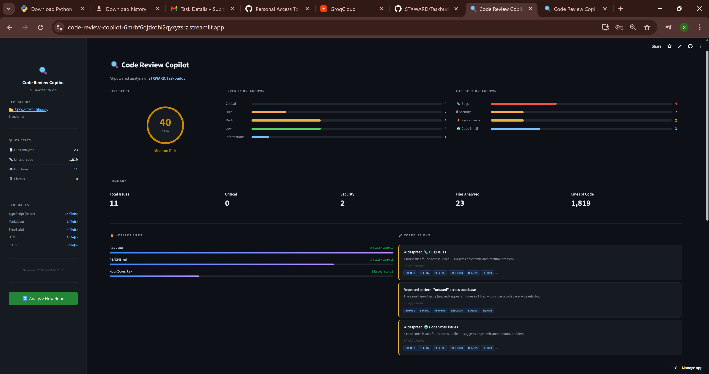
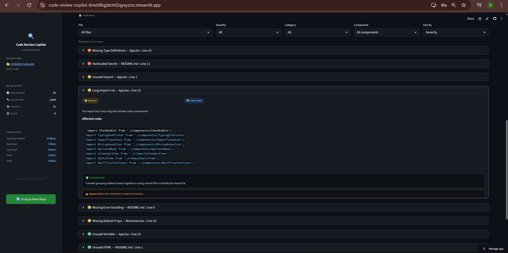

# Code Review Copilot

AI-powered code review tool that analyzes any GitHub repository for bugs, security vulnerabilities, performance issues, and code smells using Groq (LLaMA 3.3-70B).

## Live Demo
https://code-review-copilot-6mrbf6qjzkohl2qyxyzsrz.streamlit.app/

## Screenshot

## Features
- Analyzes up to 15 files per repo in parallel
- Detects bugs, security issues, performance problems, code smells
- Severity scoring: Critical / High / Medium / Low / Informational
- Risk score 0–100 with visual ring
- Hotspot files and cross-file correlation engine
- Filter by severity, file, category, and component
- Automatic API key rotation on rate limit

## Setup

1. Clone the repo

git clone https://github.com/STXWARD/code-review-copilot
cd code-review-copilot

2. Create and activate virtual environment
python -m venv venv
venv\Scripts\activate

3. Install dependencies
pip install -r requirements.txt

4. Create a `.env` file in the root folder
GROQ_API_KEY_1=gsk_...
GROQ_API_KEY_2=gsk_...
GROQ_API_KEY_3=gsk_...
GITHUB_TOKEN=ghp_...
   Get free Groq keys at https://console.groq.com/keys

5. Run the app
streamlit run app.py

## Architecture
GitHub URL
↓
src/github_ingestion.py   → Fetches repo files via GitHub REST API
↓
src/parser.py             → AST + regex code parser
↓
src/analyzer.py           → Groq AI analysis engine (LLaMA 3.3-70B)
↓
src/scoring.py            → Risk scoring + correlation engine
↓
src/report.py             → Report builder
↓
app.py                    → Streamlit UI

## Tech Stack
- Frontend: Streamlit
- AI Engine: Groq API (llama-3.3-70b-versatile)
- GitHub Data: GitHub REST API
- Code Parsing: Python AST module + regex
- Parallel Processing: ThreadPoolExecutor

## Limitations
- Free Groq tier: 100k tokens/day per key (~2 full scans)
- File cap: 15 files per scan
- Dependency vulnerability detection: planned next step
- Non-Python AST: planned (tree-sitter)

## Built By
Steward Jacob — BCA Data Science & AI, Yenepoya University Bangalore  
Built for Eli Lilly Data AI & Analytics Internship Assignment